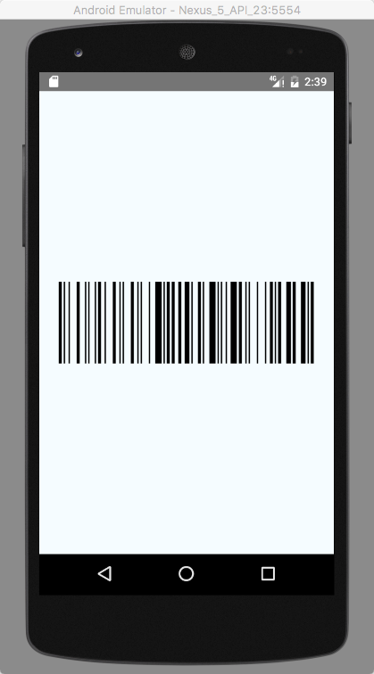

# react-native-barcode-builder

React Native component to generate barcodes. Uses [JsBarcode](https://github.com/lindell/JsBarcode) for encoding of data.

## Getting started

This library uses [@react-native-community/react-native-svg](https://github.com/react-native-community/react-native-svg) instead of [@react-native-community/art](https://github.com/react-native-community/art)

#### Step 1

Install `react-native-barcode-builder`:

    npm install react-native-barcode-builder --save

or 

    yarn add react-native-barcode-builder
  
#### Step 2

Start using the component

```javascript
import Barcode from 'react-native-barcode-builder';

<Barcode value="Hello World" format="CODE128" />
```

You can find more info about the supported barcodes in the [JsBarcode README](https://github.com/lindell/JsBarcode#supported-barcodes).



## Properties

<table style="width:80%">
  <tr>
    <th>Property</th>
    <th>Description</th>
  </tr>
  <tr>
    <td><code>value</code></td>
    <td>What the barcode stands for (required).</td>
  </tr>
  <tr>
    <td><code>format</code></td>
    <td>Which barcode type to use (default: CODE128).</td>
  </tr>
  <tr>
    <td><code>width</code></td>
    <td>Width of a single bar (default: 2)</td>
  </tr>
  <tr>
    <td><code>height</code></td>
    <td>Height of the barcode (default: 100)</td>
  </tr>
  <tr>
    <td><code>text</code></td>
    <td>Override text that is displayed.</td>
  </tr>
  <tr>
    <td><code>lineColor</code></td>
    <td>Color of the bars and text (default: #000000)</td>
  </tr>
  <tr>
    <td><code>background</code></td>
    <td>Background color of the barcode (default: #ffffff)</td>
  </tr>
  <tr>
    <td><code>onError</code></td>
    <td>Handler for invalid barcode of selected format</td>
  </tr>
</table>
